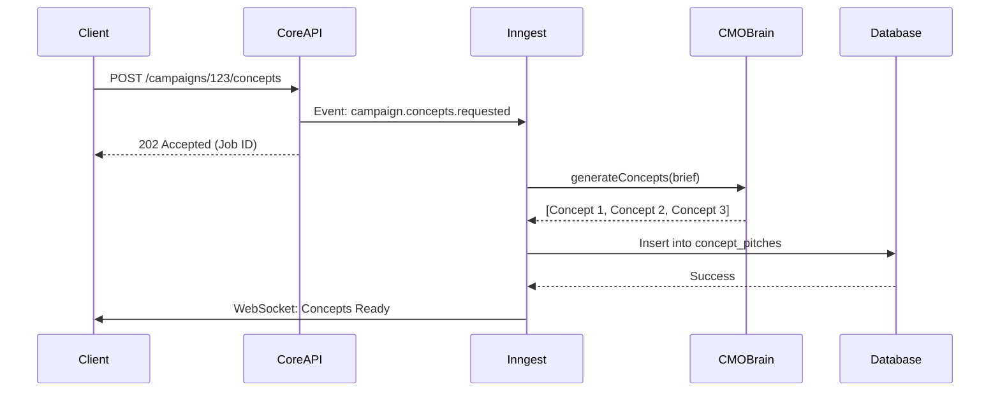
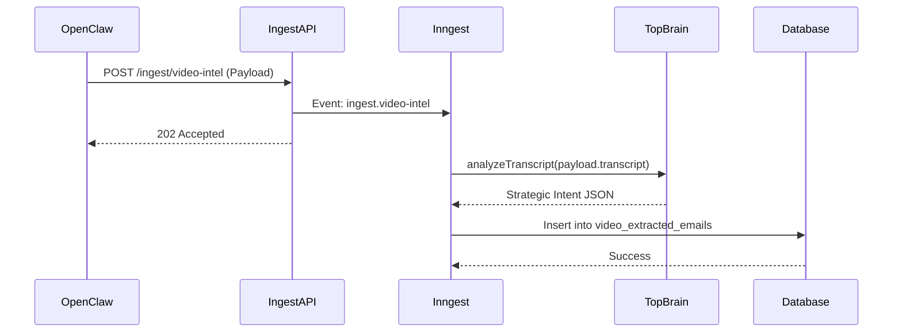

# R18 — Global Wiring Map Enterprise Specification

## 1. Executive Summary

This document provides an exhaustive, enterprise-grade specification for the global wiring map of the VIYO platform. It details the microservice architecture, API endpoints, event-driven triggers (Inngest/webhooks), and data flow between the core components, including the new Multi-Model Image Pipeline, Video Ingestion Module, and Creative Concept Mode. This map serves as the single source of truth for how data moves through the system.

## 2. Architecture Overview

VIYO employs a hybrid architecture, combining a monolithic core (Next.js/Supabase) with specialized microservices for resource-intensive tasks (e.g., image generation, video processing, countdown timers).

### 2.1 Core Services
- **VIYO Core (Next.js):** Handles user authentication, UI rendering, API routing, and database interactions via Supabase.
- **Database (Supabase PostgreSQL):** The central source of truth for users, organizations, campaigns, assets, and analytics.
- **Event Bus (Inngest):** Manages asynchronous background jobs, retries, and scheduled tasks.

### 2.2 Specialized Microservices
- **AI Orchestrator (`viyo-ai-orchestrator`):** Manages interactions with LLMs (OpenAI, Gemini) and handles prompt caching.
- **Image Pipeline (`viyo-image-pipeline`):** Routes requests to NanoBanana, Ideogram, or Imagen based on visual intent.
- **Video Ingestion API (`viyo-video-ingest`):** Receives structured data from local OpenClaw extractors and triggers cloud analysis.
- **Timer Service (`viyo-timer-service`):** Self-hosted Node.js service that generates animated GIF countdown timers on the fly.

## 3. Data Flow & API Endpoints

### 3.1 Campaign Creation Flow
1. **Client -> VIYO Core:** `POST /api/campaigns` (Create draft)
2. **Client -> VIYO Core:** `POST /api/campaigns/:id/concepts` (Trigger Creative Concept Mode)
3. **VIYO Core -> Event Bus:** Enqueue `generate-concepts` job.
4. **Event Bus -> AI Orchestrator:** Request 3 distinct concepts from CMO Brain.
5. **AI Orchestrator -> Event Bus:** Return concepts.
6. **Event Bus -> VIYO Core:** Update campaign state and notify client via WebSocket.

### 3.2 Multi-Model Image Generation Flow
1. **Client -> VIYO Core:** `POST /api/assets/generate` (Request image)
2. **VIYO Core -> Event Bus:** Enqueue `generate-image` job.
3. **Event Bus -> Image Pipeline:** Route to appropriate model (NanoBanana, Ideogram, Imagen).
4. **Image Pipeline -> External API:** Call the selected model.
5. **External API -> Image Pipeline:** Return image URL/buffer.
6. **Image Pipeline -> Supabase Storage:** Upload image and get public URL.
7. **Image Pipeline -> Event Bus:** Return asset metadata.
8. **Event Bus -> VIYO Core:** Update asset library and notify client.

### 3.3 Video/IG Ingestion Flow
1. **OpenClaw Extractor -> Video Ingestion API:** `POST /api/ingest/video-intel` (Send structured JSON payload with extracted frames, OCR text, and transcription).
2. **Video Ingestion API -> Event Bus:** Enqueue `analyze-video-intel` job.
3. **Event Bus -> AI Orchestrator:** Send payload to Top Brain for strategic analysis and pattern extraction.
4. **AI Orchestrator -> Supabase:** Store extracted intelligence in `video_extracted_emails` and update `skills_registry` if new patterns are found.

### 3.4 Countdown Timer Flow
1. **Email Client -> Timer Service:** `GET https://api.viyo.email/timer/:endDate?params...` (Fetch GIF)
2. **Timer Service:** Generate animated GIF frames based on the current time and `endDate`.
3. **Timer Service -> Email Client:** Stream GIF buffer with appropriate caching headers (no-cache).

## 4. Event-Driven Architecture (Inngest)

Inngest is used to decouple long-running tasks from the main request-response cycle, ensuring the UI remains responsive.

### 4.1 Key Inngest Functions
- `campaign.generateConcepts`: Handles the "Pitch Me Concepts" flow.
- `asset.generateImage`: Handles the Multi-Model Image Pipeline.
- `ingest.analyzeVideo`: Handles the Top Brain analysis of ingested video data.
- `email.compileAndSend`: Compiles the MJML payload and dispatches via the configured ESP (e.g., Klaviyo).

### 4.2 Retry Logic & Dead Letter Queue
- All Inngest functions have configured retry policies (e.g., exponential backoff for API rate limits).
- Failed jobs are moved to a Dead Letter Queue (DLQ) for manual inspection and re-processing.

## 5. Security & Authentication

- All API endpoints are secured using Supabase Auth (JWT).
- The Video Ingestion API requires a dedicated API key with restricted permissions (`brand_api_keys` table).
- Webhooks from external ESPs are verified using cryptographic signatures.

## 6. Edge Case Handling

- **External API Outage:** If Ideogram is down, the Image Pipeline falls back to NanoBanana (if applicable) or alerts the user.
- **Event Bus Failure:** VIYO Core implements a circuit breaker pattern. If Inngest is unreachable, critical synchronous tasks may fail gracefully, while background tasks are queued locally until the connection is restored.

## 7. Advanced API Endpoint Specifications

### 7.1 POST `/api/v1/campaigns`
Creates a new draft campaign.
- **Request Body:**
  ```json
  {
    "brand_id": "uuid",
    "objective": "abandoned_cart",
    "target_audience": "all_subscribers",
    "creative_autonomy": "pitch_me_first"
  }
  ```
- **Response (201 Created):**
  ```json
  {
    "campaign_id": "uuid",
    "status": "draft",
    "created_at": "2026-04-23T10:00:00Z"
  }
  ```

### 7.2 POST `/api/v1/campaigns/:id/concepts`
Triggers the CMO Brain to generate concepts.
- **Request Body:** Empty.
- **Response (202 Accepted):**
  ```json
  {
    "job_id": "inngest_job_id",
    "status": "processing"
  }
  ```

### 7.3 GET `/api/v1/campaigns/:id/concepts`
Polls for the generated concepts.
- **Response (200 OK):**
  ```json
  {
    "status": "complete",
    "concepts": [
      {
        "id": "uuid",
        "title": "Concept 1",
        "rationale": "...",
        "visual_direction": "...",
        "copy_angle": "..."
      }
    ]
  }
  ```

### 7.4 POST `/api/v1/assets/generate`
Synchronous or asynchronous image generation request.
- **Request Body:**
  ```json
  {
    "visual_brief": "A minimalist workspace with a coffee cup.",
    "aspect_ratio": "16:9",
    "brand_guidelines": { "colors": ["#000000", "#ffffff"] }
  }
  ```
- **Response (202 Accepted):**
  ```json
  {
    "asset_id": "uuid",
    "status": "generating",
    "estimated_time_sec": 15
  }
  ```

## 8. Detailed Inngest Job Definitions

### 8.1 `campaign.generateConcepts`
```typescript
import { inngest } from '@/lib/inngest';
import { generateConcepts } from '@/lib/ai/cmo-brain';
import { supabase } from '@/lib/supabase';

export const generateConceptsJob = inngest.createFunction(
  { id: 'generate-concepts', retries: 3 },
  { event: 'campaign.concepts.requested' },
  async ({ event, step }) => {
    const { campaignId, brief } = event.data;

    const concepts = await step.run('call-cmo-brain', async () => {
      return await generateConcepts(brief);
    });

    await step.run('save-concepts', async () => {
      await supabase.from('concept_pitches').insert(
        concepts.map(c => ({ ...c, campaign_id: campaignId }))
      );
    });

    await step.run('notify-client', async () => {
      // Send WebSocket event to client
    });

    return { success: true, count: concepts.length };
  }
);
```

### 8.2 `asset.generateImage`
```typescript
import { inngest } from '@/lib/inngest';
import { routeVisualIntent } from '@/lib/ai/visual-router';
import { generateWithIdeogram, generateWithNanoBanana } from '@/lib/ai/image-models';

export const generateImageJob = inngest.createFunction(
  { id: 'generate-image', retries: 2 },
  { event: 'asset.image.requested' },
  async ({ event, step }) => {
    const { assetId, brief } = event.data;

    const intent = await step.run('route-intent', async () => {
      return await routeVisualIntent(brief);
    });

    let imageUrl;
    if (intent === 'ideogram') {
      imageUrl = await step.run('generate-ideogram', () => generateWithIdeogram(brief));
    } else {
      imageUrl = await step.run('generate-nanobanana', () => generateWithNanoBanana(brief));
    }

    await step.run('update-asset', async () => {
      // Update DB with URL
    });

    return { success: true, url: imageUrl };
  }
);
```

## 9. Webhook Handlers

### 9.1 Stripe Webhooks
Handles subscription upgrades and token purchases.
- **Endpoint:** `POST /api/webhooks/stripe`
- **Events Handled:**
  - `invoice.paid`: Adds tokens to the organization's balance.
  - `customer.subscription.updated`: Updates the tier limits.
  - `customer.subscription.deleted`: Downgrades to Free tier.

### 9.2 ESP Webhooks (e.g., Klaviyo)
Handles bounce, drop, and spam complaint events.
- **Endpoint:** `POST /api/webhooks/esp`
- **Logic:** Updates the internal `contacts` table and triggers a Top Brain analysis if bounce rates exceed 2%.

## 10. Sequence Diagrams (Mermaid)

### 10.1 Concept Generation Sequence


### 10.2 Video Ingestion Sequence


## 11. Build Tracker (WIRE-01 through WIRE-05)

| Feature ID | Name | Version | Phase | Dependencies |
|-----------|------|---------|-------|-------------|
| WIRE-01 | Core API Routing (Next.js) | V1 | Phase 1 | None |
| WIRE-02 | Inngest Event Bus Setup | V1 | Phase 1 | WIRE-01 |
| WIRE-03 | AI Orchestrator Service Wiring | V1 | Phase 1 | WIRE-02 |
| WIRE-04 | Video Ingestion Webhook Handler | V1 | Phase 2 | WIRE-02 |
| WIRE-05 | Timer Service Microservice | V1 | Phase 2 | None |
